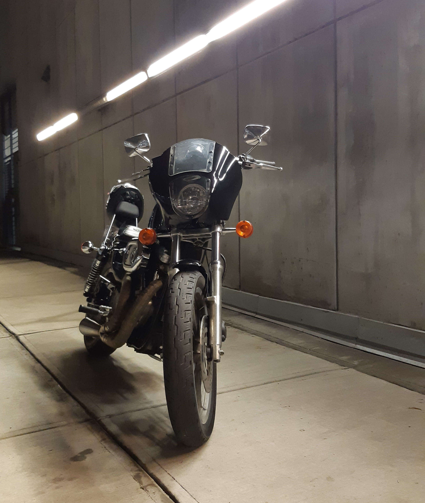
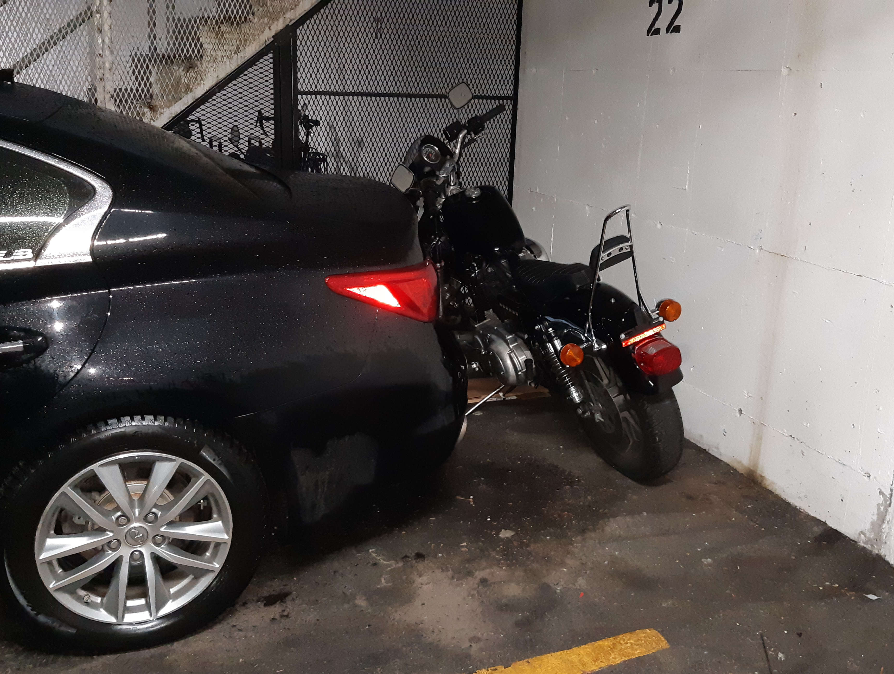

## The beginnings of a slow descent into financial ruin

Bored out of my mind during covid and with a little extra cash in my pocket, I figured the most rational solution to both these problems would be a project vehicle. I spent months driving all over Vancouver and the Lower Mainland in search of an old American truck and almost ended up with a 1970 Ford F250 Highboy but that sale fell through.

    

After some more fruitless searching, I figured a motorbike might be a better project since I wouldn't need to rent another parking spot from my building to park it - I could just stuff it behind my car. I quickly found a 1994 Sportster out in Abbotsford on sale for cheap and decided to jump on it. This bike looked great and sounded great - a previous owner had a Zipper Performance 1200cc Big Bore Kit with a 2-1 exhaust installed. I enlisted the help of my good friend and coworker Matt who had just bought himself a truck to help me pick it up, so on a rainy February evening we picked up a U-Haul motorcycle trailer and made the trek out. The sale went relatively smoothly, we got papers at the nearest ICBC, loaded up the bike, and brought it home.

    

This is where the problems began, a nice little omen of what's to come. The bike had a _serious_ bed wetting problem and would leak fuel from the carburetor's overflow hose. I forgot to close the petcock after we loaded it up on the trailer and it dumped almost the entire tank of gas out on the drive home, and spilled whatever was left in the garage while we were out returning the trailer. This marked the beginning of a long, frustrating, and expensive journey getting it road ready for the spring.