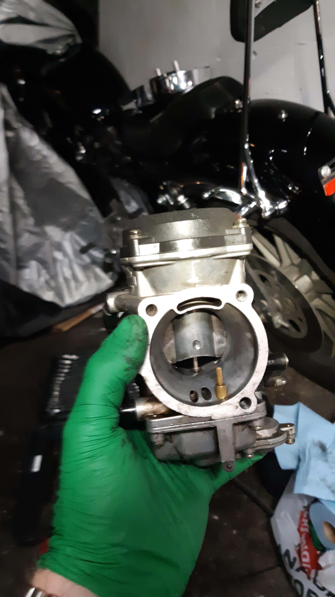
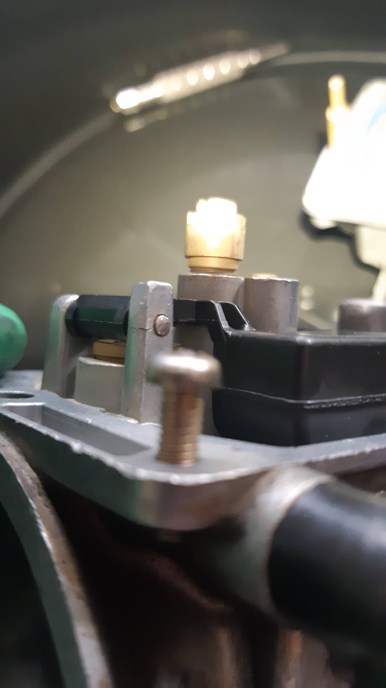
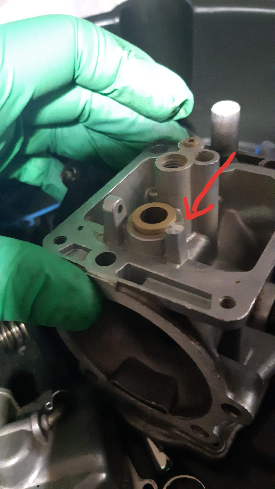
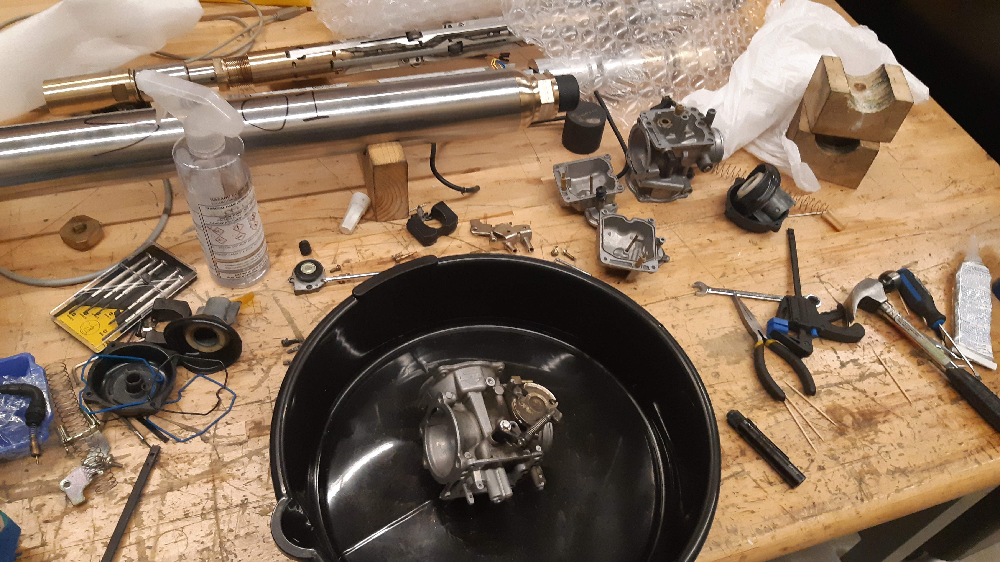
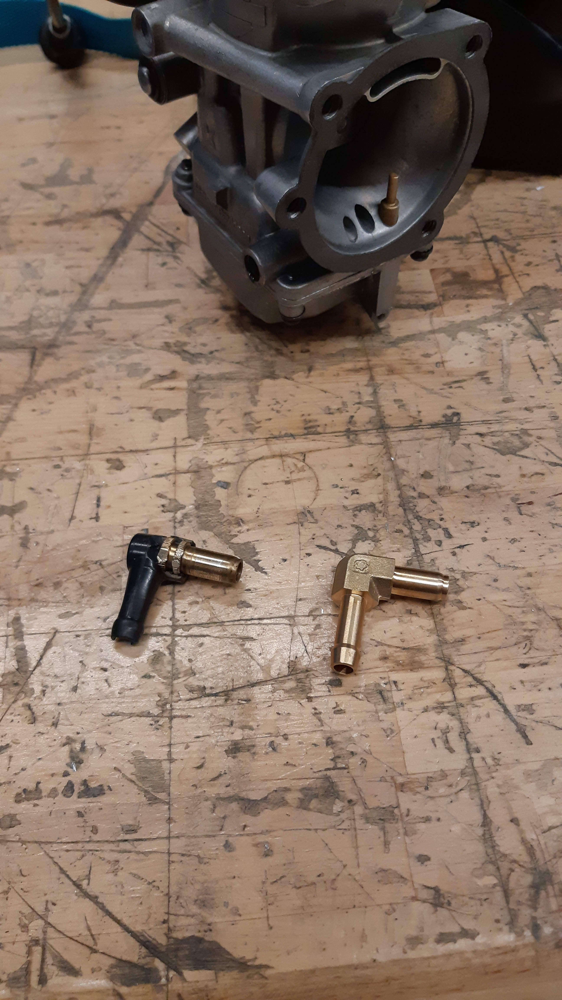
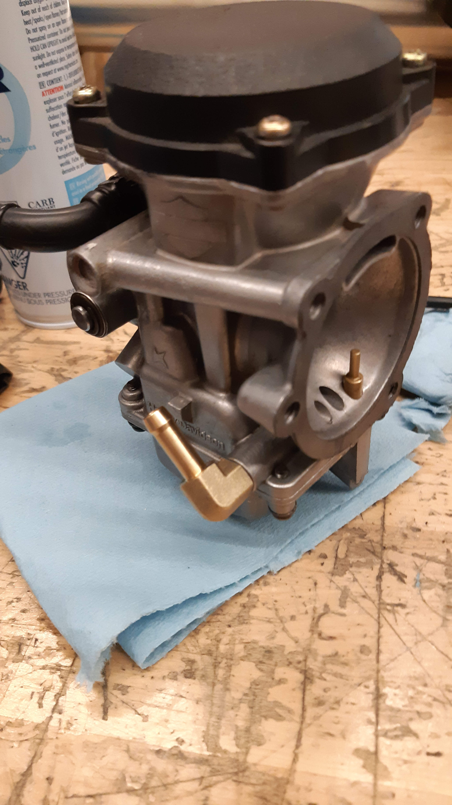

## Hope for the best, expect the worst

Shortly after buying a modified `94 Sportster, I realized it had a pretty serious fuel leak coming from the carburetor's overflow hose. This could mean one of two things: the carburetor's float level wasn't properly adjusted, or something internally was broken. Most carburetors have a fuel bowl which is filled from the tank and need some mechanism to prevent overflowing. The Harley CV carbs have a big plastic flap in them called the "float" which rises as the bowl is filled with fuel, and blocks the fuel inlet once the bowl is filled. I was _hoping_ the float would need a small adjustment, but quickly came to learn that when it comes to this bike, I can should expect the worst case scenario.

I removed the carburetor, ran to Canadian Tire for some carb cleaner, made a quick stop at the local Harley dealership for a rebuild kit, then headed to the shop at my work to pull it apart and inspect it. Here is where I realized that the poorly adjusted float was going to be the least of my worries.

The float pin (the little round metal dot right above the screw in the middle of the above picture) is meant to be removed **ONE WAY ONLY**, there's warnings all over the service manual and a big bold arrow cast into the body of the carburetor to show which way it goes out. Whoever was previously messing with this carburetor had obviously ignored the warnings and either tried to tap it out or put it back in the wrong way - evidence of which can be seen in the hairline crack on the (taller) float post. The moment one of these breaks, the carburetor becomes a piece of scrap metal.

I tried to remove the pin as delicately as I could, but the damage had already been done and the post snapped off immediately...

I did what every reasonable home mechanic would do, and went back to Canadian Tire to pick up some JB Weld. I gave it 3 good tries with no luck and I'm not even going to bother putting up the pictures. After giving up on this idea, I called around a few local shops to try and find a replacement and they all pointed me in the direction of a small shop in the next town over. I left the owner a voicemail and he called me back the next day with some good news - he had a shop full of these things and was actually asking a reasonable price for them! I picked one up the next day, tore it down to give it a good scrub, cleaned the remaining parts of my old one, then assembled a franken-carb from the best components of the two. While I was at it, I replaced the cheap (and cracked) fuel inlet elbow with a brass one I had ordered from Fortnine.

<!--   -->

| | |
| -| - |
| |  |

While I was cleaning the jets, I noticed the original carb had a 40 pilot and 170 main jet, which I'm pretty sure is the jetting for the stock 883 motor and _definitely_ not big enough for the 1200, especially at sea level. Luckily the replacement carburetor had a 45 pilot and 180 main so I swapped those in, set the float level, put the whole thing back together and installed it back on the bike. 

I opened the petcock and let it sit for 10 minutes, luckily there was no more fuel leaking from the overflow hose! I cranked it over and it idled like a peach. After all was said and done, this carburetor fiasco took me almost two weeks to get sorted... Not a great start.

